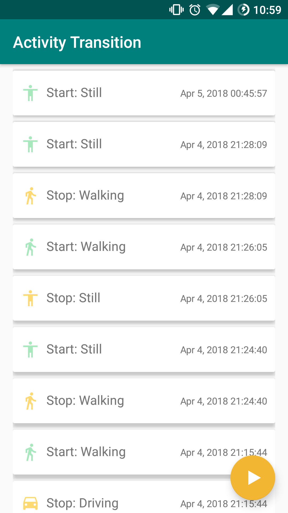

# Activity Transition

This demo app shows the use of the Activity Recognition Transition API, also called the Transition API for short.

## General Information

The API was introduced by Google on 20 March 2018 and designed for detecting the start and end of particular activities.

In some cases it might be necessary to design the app to identify when a user starts or stops a particular activity, such as walking, biking, or driving. I.e. a mileage tracking app could start tracking miles when a user starts driving, or a messaging app could mute all conversations until the user stops driving.

Please follow [this link](https://android-developers.googleblog.com/2018/03/activity-recognitions-new-transition.html) for detailed information on Transitions API. Also, check out the [official API guide](https://developer.android.com/guide/topics/location/transitions.html) in Android Developers website.

## Instructions

Press play FAB to start detecting activity transitions. Once new activity transition is detected it will be saved in database and displayed in the activity. Activity detection will run silently in foreground service. Therefore there is no need to leave the app open. To terminate the detection service, open the app again and press stop FAB.

## License

    Copyright 2018 Orkhan Gasimli

    Licensed under the Apache License, Version 2.0 (the "License");
    you may not use this file except in compliance with the License.
    You may obtain a copy of the License at

        http://www.apache.org/licenses/LICENSE-2.0

    Unless required by applicable law or agreed to in writing, software
    distributed under the License is distributed on an "AS IS" BASIS,
    WITHOUT WARRANTIES OR CONDITIONS OF ANY KIND, either express or implied.
    See the License for the specific language governing permissions and
    limitations under the License.
